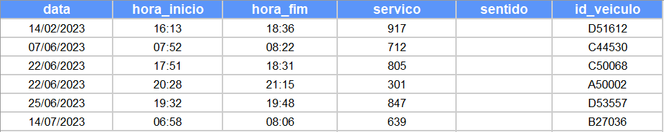

# Algoritmo de Classificação de Recursos de Viagens Individuais - Linhas Não Circulares

---

Desenvolvido por: Igor Laltuf

## Descrição

Para que serve, como funciona

print do esquema no miro (remover o meme do cachorro)


## Modo de Usar

1. Preparar o ambiente

abrir o env
usar o requirements.txt para instalar 
verificar se o arquivo com a amostra está na pasta raw no formato especificado
verificar se as credenciais de acesso ao BQ estão em ...

Executar: python run.py

ver se o repo é publico (confirmar)

inserir o diretório das credenciais do big query bno arquivo set_credentials.py


2. Arquivo de input

A pasta `data/raw` deve conter um arquivo no formato xlsx contendo os dados das viagens individuais que serão avaliadas pelo algoritmo. O arquivo deve conter apenas uma aba e as seguintes colunas:



Sobre os dados do arquivo:
- a coluna id_veiculo deve conter o dígito antes do número do veículo;
- a coluna sentido deve existir, mesmo que esteja vazia; e
- os dados do arquivo `arquivo_de_exemplo.xlsx` no diretório `data/raw` devem ser usados apenas para fins de testes do algoritmo. Os dados das viagens que constam no arquivo foram alterados manualmente e não devem ser considerados para análises sobre as respectivas viagens.


3. Como executar o algoritmo


4. Como interpretação dos resultados


```
├── README.md                  <- Descrição do resumo da análise
├── data
│   ├── output                 <- Dados finais (tabelas de resumo e afins)
│   ├── treated                <- Dados tratados
│   ├── figures                <- Imagens geradas da análise
│   └── raw                    <- Arquivo com os dados da amostra no formato .xlsx
├── scripts                    <- Scripts Python/R
│   ├── run.py                 <- Script que executa o algoritmo
│   ├── log                    <- Log files
│   ├── utils                  <- Scripts auxiliares, funções de utilidade geral, etc
|   ├── queries                <- Scripts de queries
│   └── data_processing        <- Scripts específicos para pré-processamento de dados
└── requirements.txt           <- Pacotes específicos da análise

```
