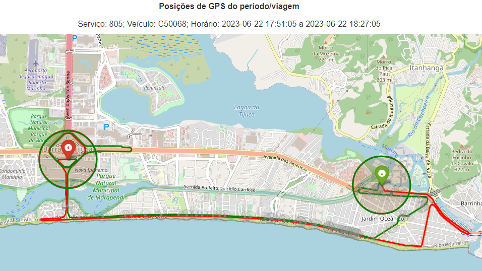
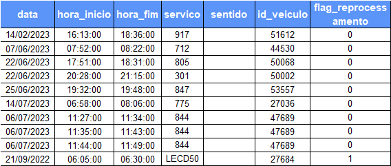

# Algoritmo de Classificação de Recursos (ACRe)

---

Desenvolvido por: Igor Laltuf

## Descrição

O algoritmo presente neste repositório tem como objetivo classificar as viagens individuais presentes nos recursos de pagamento do subsídio. O funcionamento do algoritmo ocorre conforme mostra a figura abaixo:
**Atualizar a imagem abaixo para a nova versão**


O algoritmo recebe um arquivo contendo informações sobre as viagens e retorna um status, que pode ser:

# revisar as classificações abaixo
- Viagem duplicada na amostra
- Viagem identificada e já paga
- Viagem identificada e já paga para serviço diferente da amostra
- Viagem inválida - Não atingiu % de GPS ou trajeto correto
- Viagem inválida - Não atingiu % de GPS ou trajeto correto para serviço diferente da amostra
- Sinal de GPS encontrado para o veículo operando no mesmo serviço da amostra
- Sinal de GPS encontrado para o veículo operando em serviço diferente da amostra

**trocar amostra por recurso** nas categorias


Por fim, para os casos em que os dados do sinal de GPS são encontrados para o serviço da amostra no momento da viagem, são gerados mapas que comparam os sinais de GPS com o trajeto. Estes mapas ficam disponibilizados no diretório `data/output/maps`:





## Modo de Usar

1. Preparar o ambiente


```bash
python -m venv env
. dbt-env/bin/activate # no Windows, usar . dbt-env/Scripts/activate
pip install -r requirements.txt
```

* Configure suas credenciais para leitura/escrita no datalake:
Preencha suas credencias no arquivo `scripts/set_credentials.py`


verificar se o arquivo com a amostra está na pasta raw no formato especificado


2. Arquivo de input

A pasta `data/raw` deve conter um arquivo no formato xlsx contendo os dados das viagens individuais que serão avaliadas pelo algoritmo. O arquivo deve conter apenas uma aba e as seguintes colunas:



Sobre os dados do arquivo:
- a coluna id_veiculo não deve conter o dígito antes do número do veículo;
- a coluna sentido deve existir, mesmo que esteja vazia; e
- os dados do arquivo `arquivo_de_exemplo.xlsx` no diretório `data/raw` devem ser usados apenas para fins de testes do algoritmo. Os dados das viagens que constam no arquivo foram alterados manualmente e não devem ser considerados para análises sobre as respectivas viagens.

A flag reprocessamento se for 0 ... se for 1...


3. Como executar o algoritmo

* Execute o arquivo `run.py` para iniciar o algoritmo:

```bash
python scripts/run.py
```

Flags cache e rpc (explicar cada uma )
```bash
python scripts/run.py --cache
```

```bash
python scripts/run.py --rpc
```


4. Como interpretação dos resultados


- Viagem duplicada na amostra: a amostra contém duas ou mais viagens em que o mesmo veículo opera ao mesmo tempo.

- Viagem identificada e já paga
- Viagem identificada e já paga para serviço diferente da amostra
- Viagem inválida - Não atingiu % de GPS ou trajeto correto
- Viagem inválida - Não atingiu % de GPS ou trajeto correto para serviço diferente da amostra
- Sinal de GPS encontrado para o veículo operando no mesmo serviço da amostra
- Sinal de GPS encontrado para o veículo operando em serviço diferente da amostra


O repositório é público?


```
├── README.md                  <- Descrição do resumo da análise
├── data
│   ├── output                 <- Dados finais (tabelas de resumo e afins)
│   ├── treated                <- Dados tratados
│   ├── figures                <- Imagens geradas da análise
│   └── raw                    <- Arquivo com os dados da amostra no formato .xlsx
├── scripts                    <- Scripts Python
│   ├── run.py                 <- Script que executa o algoritmo
│   ├── set_credentials.py     <- Configurações das credenciais do Big Query
│   ├── log                    <- Log files
|   ├── queries                <- Scripts de queries
│   └── data_processing        <- Scripts específicos para pré-processamento de dados
└── requirements.txt           <- Pacotes específicos da análise

```
